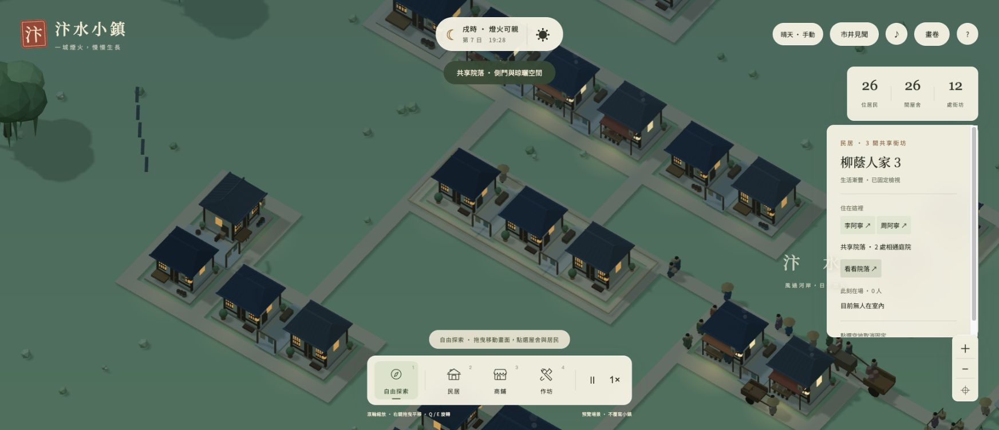

# 汴水小鎮

以《清明上河圖》的市井生活為靈感，使用 Three.js 製作的宋代河畔小鎮觀察遊戲原型。放下一處街坊，看施工、入住、工作與採買慢慢發生。



## 啟動

需要 Node.js 22 與 npm。

```sh
npm install
npm run dev
```

開啟終端機顯示的本機網址，通常是 http://127.0.0.1:5173 。

```sh
npm test
npm run build
npm run preview
```

## 第四版：雨巷與物產

- 天候按鈕依序切換自然、細雨、晴天；雨中行人撐傘，部分居民避雨，街頭聚會暫歇，晾衣與河岸活動收起。
- 點選相連街坊的屋舍 →「看看院落」，觀察共享庭院、側門、長凳與晾曬空間。
- 泥料→陶器、木材→木器、纖維→布匹；漕船卸貨、牛車供料、工匠加工、推車送店、來客採買實際連動。
- 「市井見聞」→「物產流轉」可篩選品項、查看航次與每次移交，並定位尚未售出的貨物。查看時暫停模擬。
- 「去街口看看」可前往當前聚會，散場後仍可回看上一場地點；手機跳轉後自動收起面板。
- 自動遷移 v1–v3 存檔，既有存貨保留為「日用雜貨」。原有屋舍、居民與貨量保留。

每份原料簡化為一件成品；未售存量達 96 件時暫停新船補貨（一次航次 12 件），已售貨物保留最近 24 件明細，其餘累計於總數。這是觀察型生產模擬，不含價格與獲利管理。

驗證紀錄與截圖見 [第四版交接](docs/V4-HANDOFF.md)。

## 第三版：有故事的市井

- 點選居民 →「跟著他過一天」；或先點屋舍，再點住戶／工作者姓名。
- 鏡頭跟著居民移動，入屋後停在所在屋舍；今日記事記錄真實工作、採買、聚會與返家，最多保留當日 12 筆。
- 拖曳場景、按 Esc、切換建造模式、重設視角或按「停止跟隨」即可退出。
- 說書、攤前新貨、茶坊熟客三種聚會輪流出現；居民沿道路到場、停留、散去。從「市井見聞」可以前往現場。
- 行人靠右分流，同向保持距離；牛車與推車優先，虹橋擁擠時放慢。
- 自動讀取第一、二版進度，轉為第三版存檔；原有屋舍、居民與貨運進度保留。

第三版完成原提案的優先範圍；第四版已接續完成雨天、共享院落與多品項生產。畫卷巡遊與存檔匯出／匯入仍不在目前範圍。避讓採局部規則與視覺側移，尚非完整物理碰撞；路口交會、進出屋舍與停靠點仍可能短暫重疊，也尚未加入攤位排隊。

驗證與限制見 [第三版交接](docs/V3-HANDOFF.md)。

## 已實作

- 從河畔空地開始；另有可選擇的示範小鎮。
- 民居、商鋪、作坊；一次拖曳放置 1–3 個相連單元，共用街坊。
- 道路只沿街坊外緣生成，街坊內部沒有道路；分離街坊自動接路。
- 地基、木架、覆瓦砌牆、落成、生活細節五個階段。
- 住戶、職業、目的地、道路尋路、工作／採買／返家日程。
- 居民與挑擔來客、手推車、牛車、碼頭腳夫與漕船。
- 貨船收桅過橋、靠岸卸貨、貨棧、牛車送貨、商鋪採買的完整貨物流通。
- 虹橋往來與觀船、城門來客、橋頭攤棚、巷口交談與夜間散場。
- 門前工作、晾衣擺動、炊煙、工匠動作、釣魚洗衣與河岸犬鴨飛鳥。
- 可關閉的程序化環境音：河水、風聲、鳥鳴、夜蟲、木作和車輪聲。
- 建築與居民檢視卡，資訊直接來自模擬狀態。
- 日夜循環、窗戶與燈籠暖光、軟光暈；入住狀態影響窗光。
- 探索、相機平移／縮放／旋轉、暫停、1×／2×／4×速度。
- 本機自動存檔、清除前確認、繁體中文介面與窄螢幕版面。
- 四張生成概念圖，可透過「畫卷」瀏覽。
- 「市井見聞」顯示真實模擬事件與貨況；可一鍵觀察虹橋、碼頭、街坊。
- 舊版存檔自動遷移，保留原有建築與居民；新示範鎮為 26 間建築、26 位居民。

## 操作

| 操作 | 功能 |
|---|---|
| 1 / 2 / 3 / 4 | 探索 / 民居 / 商鋪 / 作坊 |
| 探索模式拖曳、或右鍵拖曳 | 平移相機 |
| 滾輪、右側 ＋ / − | 縮放 |
| Q / E | 旋轉相機 |
| 空白鍵 | 暫停／繼續 |
| Esc | 回到探索，取消固定檢視 |
| 停留／點選屋舍或居民 | 查看／固定檢視卡 |

「♪」按鈕是環境音開關，預設不播放。「?」說明裡可調整音量。

## 模擬與效能

`src/simulation.js` 為獨立、可測試的狀態模型。街坊以格位集合保存，外周道路以整數座標圖建模；廣度優先搜尋負責接路與居民尋路。新建築會重新計算道路，已有移動者會從最近道路節點重新尋路。

`src/life.js` 管理漕船、碼頭腳夫、牛車、來客、交談與貨物守恆。來客與運輸走同一道路圖，過橋人物依橋面高度渲染；貨船先收桅再過橋。

`src/scene.js` 用程式建立低面數模型，依材質合併靜態網格，降低繪製呼叫。軟燈光以發光材質及漸層光暈平面呈現，不使用大量即時點光源。

完整日夜約 6 分鐘，建築約 18 秒落成，約 85 秒長出額外生活細節。切換分頁或開啟說明／畫卷／物產流轉時暫停模擬；不模擬離線成長。

## 視覺資產

`public/concepts/` 的四張概念圖於開發前使用內建 imagegen 生成。原圖保留於生成工具的預設位置；提示詞與檢視紀錄見 `docs/visual-direction.md`。

概念圖是美術方向參考，實際遊戲以簡化的程序化 3D 幾何呈現。概念圖不是實際遊戲截圖，也不是經考證的宋代建築復原。字型使用 Google Fonts，無網路時回退至系統字型。

## 驗證

`npm test`：30 項測試，涵蓋第四版雨天、院落、生產流轉、存檔相容、鏡頭定位，以及街坊邊界、原子放置、道路連通、屋頂幾何、施工／人口／工作、夜間返家、舊檔遷移、橋面路徑、漕船收桅、腳夫卸貨、牛車送達、貨物守恆與有限時間交談。

`tests/browser-check.mjs`：獨立 Chromium 自動測試及截圖。先啟動開發伺服器，安裝 Playwright 對應瀏覽器後執行：

```sh
npx playwright install chromium
node tests/browser-check.mjs
node tests/journal-browser.mjs
node tests/life-browser.mjs
```

若使用已安裝的測試 Chromium，可透過 `TEST_CHROMIUM_PATH` 指定執行檔。證據位於 `evidence/`。此為自動化瀏覽器驗證，不代表使用者已完成人工驗收。

## 原型邊界

- 以《清明上河圖》為靈感，並非歷史場景的逐物考據復原；夜景、日程、音景是遊戲延伸。來源與轉譯詳見 `docs/living-town.md`。
- 河運、牛車、作坊與手推車皆連動；目前三種簡化配方，商鋪可販售一般成品，布匹優先送布莊。
- 不加入複雜居民需求、經濟懲罰或災難；目前交通共用簡化尋路，已有局部避讓，沒有完整物理碰撞。
- 動物、釣魚、洗衣與炊煙是環境活動；沒有獨立的動物生態或水產經濟。
- 環境音為程式合成；不含人物口語對白，需使用者主動開啟。
- 共享街坊由同次放置定義，單次使用同一分區；沒有拆除與混合用途編輯。
- 新增街坊造成道路重算時，移動者可能出現小幅位置調整。
- 不提供雲端同步；進度存在目前瀏覽器的 localStorage。
- 行動裝置提供窄螢幕介面，精細拖曳與旋轉仍以桌面滑鼠／鍵盤體驗為主。

## 技術

Three.js、Vite、原生 JavaScript、Node.js Test Runner、Playwright。

Three.js 使用方式參考官方文件：https://threejs.org/docs/ 。
