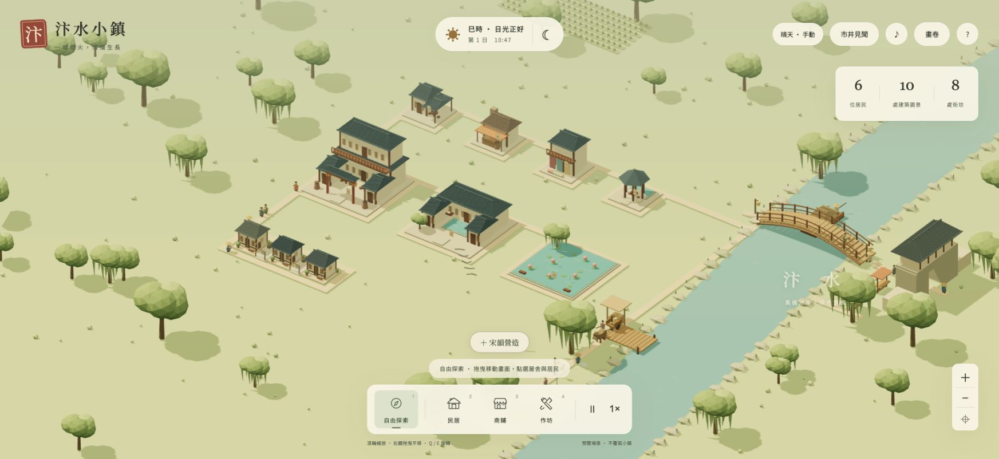
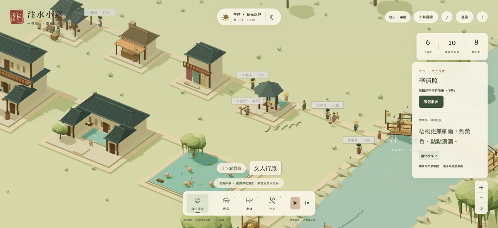

# 汴水小鎮

## 開發中：城市經營、就業與人口（尚未正式部署）

新玩家以 2400 文開始經營；舊存檔遷移保留自由營造，不追扣建設費。收支面板可切換模式與設定 0–20% 稅率。建屋、道路、搬移、擴建、升級共用報價與扣款規則，失敗不扣款；每個遊戲日結算落成建築和道路的維護費，入住與真實成交形成稅收。

存檔格式升為 9，新增 `city` 白名單；可讀版本 1–8。經營模式已加入住宅／商業／作坊需求，稅負會降低需求，居民每 15 遊戲秒依需求配額分批遷入，優先安置無家住戶。長期無家（90 秒）、失業（180 秒）或缺乏日用品（360 秒）才會每次最多遷出一人；改善條件會停止對應倒數。自由營造維持直接入住及不強制遷出。需求及原因可在「金庫 · 需求」查看；這些分數是遊戲規則，非史實城市經濟估計。欠款已影響供水與清運，完整經營循環仍待後續公共服務與宜居里程碑。商業周轉金與市府分帳，原料補貨須付成本；貨棧可升至三級，提高腳夫、牛車與每趟載量，並增加投資及維護費。詳見 [貿易與物流驗收](evidence/trade-logistics/README.md)。經營模式須自行把門前步道鋪到東側河岸引道；斷路會影響移入、通勤與送貨。大路提供雙排行人通行，費用與小路不同。詳見 [玩家道路驗收](evidence/road-network/README.md)。開發證據見 [財政驗收](evidence/city-finance/README.md)、[就業與採買](evidence/employment/README.md)、[城市成長](evidence/city-growth/README.md)。


以《清明上河圖》的市井生活為靈感，使用 Three.js 製作的宋代河畔小鎮觀察遊戲原型。放下一處街坊，看施工、入住、工作與採買慢慢發生。



## 開發中：街坊供水

「公共營造 → 街坊水井」可點蓋一格或斜拉 2×2 井院。每格建設100文；每日每格維護3文乘級數。每級供應12人（一格）或48人（四格）；一級沿路24步，每升一級增加4步。先供應現有居民，再為空屋分配剩餘容量；隔離或距離太遠無法供水。住宅卡顯示供水人數、滿意度、可入住空位與不足原因。經營模式前兩人可自備水，之後新住戶須有供水空位；供水滿意度影響住宅需求。自由營造不限制入住。水井不算休閒園景，不會提供公園加成。這些容量、距離與自備水皆為遊戲規則。

詳見 [供水驗收](evidence/water-service/README.md)。衛生清運與赤字服務衰退已實作，防火巡守亦已實作，詳見下節。

## 開發中：衛生、健康與欠款

「公共營造 → 街坊清運院」可建一格或四格設施。清運院每格100文，每日維護3文乘級數；一格每級每天處理12份、四格48份，沿路24步起，每升級增加4步。每位住戶每天產生1份髒污，作坊每件真正完成的成品產生2份；每日結算後仍未清走的負荷逐步降低健康與住宅需求。清運優先處理積存較多處，多座設施共享覆蓋時會重新分配以用足可達容量。清乾淨後健康每天回復，沒有瞬間清空積存或健康歸零。

欠款第一日起服務容量75％，第二日50％，第三日起25％；供水與清運都受影響。金庫回到非負餘額立即恢復完整容量。可調稅增收、拆除減支；欠款仍限制付費新建，但保留拆除與政策調整。自由營造不累積新衛生負荷，也不受欠款效率限制。上述數值為遊戲規則，非歷史城市衛生估計。

證據見 [衛生與欠款驗收](evidence/sanitation/README.md)。健康已接上藥鋪醫療與病假；完整幸福度（C25）尚未完成。

## 開發中：防火巡守與整修

「公共營造 → 街坊巡守所」提供沿路24步起的巡守範圍，每級增加4步；一格每級巡守8處建築、四格32處，優先高風險建築。每格100文、每日維護3文乘級數，欠款降低可巡守數量。窯坊及近鄰密度提高火警風險。巡守可使機率降至原本四分之一，事件損害由60降至12。

前兩日免事件；其後每日最多一處出現30秒預警，使用固定日序與建築ID抽樣，讀檔不會重新抽籤。畫面上方提示可定位事件；可付20文排除火警，或在期限內增設可達巡守所減輕損害。受損作坊停止生產，商鋪暫停營業；建築、貨物、住戶保留，受影響住宅居民只承受有限健康損失。損害×2遊戲秒後免費整修，也可付「損害×占地格數」文立刻修復。自由營造不產生新事件，既有事件可免費處理。

這是遊戲事件模型，非史實火災機率。驗收見 [防火證據](evidence/fire-service/README.md)。完整100項與最終四領域複評仍未完成，以上開發功能尚未部署。

## 開發中：書院教育與工匠學力

「宋韻營造 → 方塘書院」按住家到書院的步道路程提供社區教育：一級沿路24步，每升一級增加4步；每級同時提供8個名額，優先學力較低者。欠款按公共服務效率減少名額，受損、未落成或道路不通時不能供應；病假居民暫停受教。這是街坊服務覆蓋模型，不代表居民整日坐在講堂。

持續受教360遊戲秒（一遊戲日）增加10點學力，小數進度保存於居民存檔，上限100；滿額學力者不再占用名額。搬家、書院拆除或斷路不會抹除已累積學力，也不補發離線進度。舊存檔未有學力時從0開始。自由營造保留學力但不繼續累積、不套用產能加成。

作坊依「真正到場且未請病假」工匠的平均學力增加產能，每10點加2％，最高20％；不會讓缺工或缺料的作坊憑空生產。個人小卡顯示學力、作坊顯示實際加成、書院與收支總覽顯示受教名額。這些數值屬遊戲設計，證據見 [教育驗收](evidence/education/README.md)。

## 開發中：藥鋪醫療與病假

「宋韻營造 → 百草藥鋪」已提供社區醫療：依住家到藥鋪的沿路距離24步起，每升一級增加4步；只有營業中、未受損、且健康店員確實到場才有服務。每名到場店員每級同時照護4人，四格藥鋪8人；健康較低者優先，多鋪覆蓋不會重複恢復同一居民。

受照護者每30遊戲秒恢復8點健康，最高100。健康未滿40者返家病假，保留工作但不計入到場員工、醫療人力或生產力；健康回到40後按原排程返工。藥鋪休業、斷路、受損或店員離開/請假會停止醫療。這是依住家分配的社區照護抽象模型，不要求居民到櫃檯排隊，名額是同時照護上限。自由營造不結算醫療與病假。

個人小卡、藥鋪小卡及收支總覽可查看健康、病假、照護與名額。健康採整數無條件捨去顯示，避免39.75顯示40卻仍病假的矛盾。上述為遊戲規則；詳見 [醫療驗收](evidence/healthcare/README.md)。

## 線上遊玩

https://bianshui-town.pages.dev/

Cloudflare Pages 正式版；存檔依瀏覽器與網址個別保存，本機版不會自動轉移。

## 啟動

需要 Node.js 22 與 npm。

```sh
npm install
npm run dev
```

開啟終端機顯示的本機網址，通常是 http://127.0.0.1:5173 。

```sh
npm test
npm run build
npm run preview
```

## 第十版：誇張華麗升級與重置鍵

二級開始即加蓋完整樓層，三級至五級再逐層增加寬簷樓閣；四級有雙側亭樓與成排燈籠，五級改為金瓦、金色冠頂與朱紅長幡。全部 47 種占地版本逐級增高，五級模型高度超過一級兩倍。此為刻意誇張的遊戲外觀，保留原建築地面特色。

主畫面新增「重置小鎮」：先選擇保留或確認重置，確認後回到空地、正常速度及自動天候。可立即按「復原上一步」救回原小鎮；重新整理、示範小鎮或下一次營造會清除復原機會。舊版已升級建築會自動套用新的外觀。驗證見 [V10 交接](docs/V10-HANDOFF.md)。

## 第九版：五級營造

點選已落成的建築或園景，在資訊卡按「升至下一級」。所有圖錄造型均可升至五級；一格與四格建築皆適用。

| 等級 | 外觀變化 |
|---|---|
| 1 初築 | 原有特色造型 |
| 2 添彩 | 一層加蓋樓閣、大牌樓、花木與燈籠 |
| 3 華庭 | 兩層寬簷高閣與彩幡 |
| 4 重簷 | 三層高閣、雙側亭樓與成排燈籠 |
| 5 盛景 | 四層金瓦高閣、金冠與朱紅長幡 |

升級保留原有占地、樣式、住戶與貨物；滿五級後停止升級，可復原上一步。原地升級與四格擴建分開，擴建、搬移及重新讀取都保留等級。四格花園合併取原花園最高等級。

沿用版本 8 存檔，新增 `tier` 外觀等級；舊存檔以一級起算，原有居住容量與加工能力保留。此次外觀升級免費即時完成；三級以上不另提高產能。尚在施工中的建築須先落成。驗證見 [V9 交接](docs/V9-HANDOFF.md)。

## 第八版：四格街坊與宋代市集

- **自由拖曳**：直線拖曳可建 1–4 間；斜向拖曳形成 2×2，自動改建為對應大型建築，預覽會顯示占地。不再固定三格。
- **道路成廣場**：四格道路接成 2×2，會自動鋪成有石板、座椅及植栽的街坊廣場；分次鋪路也有效。道路接回原路網後，行人可進入。
- **花園成園景**：四座相鄰的一格百花公園，或直接斜拖四格，自動合成曲水疊石園，包含水池、疊石、亭榭與花木。
- **說書與田園**：新增街巷說書棚，四格變瓦舍勾欄，市井說書事件優先在此聚集；桑柳果圃四格則成帶水渠與農舍的桑柳田園。
- **街頭攤販**：果子、提瓶茶、米食、紙畫四攤出現在廣場或商鋪周邊；攤主日間出攤，夜間及雨天收攤。來客沿道路走到攤前選購，可由「公共營造 → 街頭攤販」定位與查看累積次數。
- **新作十式**：營造圖錄可依新作、民居、工坊、商鋪及公共園景篩選。每款的一格與四格版有不同空間組合；四格擴建保留原樣式。

| 類別 | 一格樣式 | 四格樣式 |
|---|---|---|
| 民居 | 竹籬小築 | 竹院田居 |
| 民居 | 望河閣居 | 望河雙閣 |
| 民居 | 梅窗人家 | 梅香庭院 |
| 工坊 | 坡頂陶坊 | 連窯陶院 |
| 工坊 | 鋸木棚坊 | 雙棚木院 |
| 工坊 | 曬布染坊 | 彩帛大院 |
| 商鋪 | 街角書肆 | 雙翼書樓 |
| 商鋪 | 清芬香鋪 | 清芬香閣 |
| 商鋪 | 百草藥鋪 | 百草庭院 |
| 商鋪 | 蒸香餅店 | 蒸香餅坊 |

史料依據：[《東京夢華錄》卷二](https://zh.wikisource.org/zh-hant/東京夢華錄/卷二)的瓦子、勾欄與買賣，[卷五](https://zh.wikisource.org/zh-hant/東京夢華錄/卷五)的講史與小說，[卷三](https://zh.wikisource.org/zh-hant/東京夢華錄/卷三)的提瓶賣茶與紙畫。建築名稱、田園與園林形制為遊戲設計，非歷史復原。

存檔升為版本 8，可讀版本 1–7。新商鋪沿用既有供貨系統；攤販選購屬市井互動，這版未新增藥材、香料或紙張生產鏈。驗證見 [V8 交接](docs/V8-HANDOFF.md)。

## 第七版：公共營造與街坊整建

- **公共營造**：青石小路、寬闊大路可點選或拖曳，最多 24 格；可移除自建道路。與街坊外圍路網接通後，行人會使用，來客也會沿新路散步。道路占地不能蓋屋；既有外圍道路、虹橋與碼頭道路保留。
- **公共花園**：圖錄新增百花公園，一格花圃或四格花園；也可建亭榭與池塘。
- **搬移**：點選已落成建築 → 搬移 → 點空地。搬移一棟（包括四格整棟），保留居民、貨物及製作進度；相連街坊的其他房屋留在原地。
- **拆除與復原**：點選建築 → 拆除 → 確認。居民保留，無住所者等候新居；庫存與相關運送貨物退回貨棧。復原上一步會恢復操作前的完整小鎮與時間，僅本次開啟期間有效；新整建取代上一筆，新建其他建築會清除舊復原紀錄。
- **原地升級**：民居變雅居小樓，可住 4 人；工坊保留原品項，加工速度 1.5 倍。
- **四格特殊建築**：四合雅宅可住 8 人；瓷窯大院、木作營造院、織錦大院可容 6 名工匠，加工速度 2 倍。可直接從圖錄選四格建造，或使用原房屋右下方的 2×2 四格擴建；須避開其他房屋與自建道路。空間不足時先搬移再擴建。

以上建築為宋式街坊的遊戲設計，並非特定歷史建築復原。存檔升為版本 7，可讀版本 1–6。小路與大路有寬度與顏色差別，目前採相同的行人速度。

驗證與限制見 [V7 交接](docs/V7-HANDOFF.md)。

## 第六版：文人行旅

下方「文人行旅」可查看五位文人的位置、跟著散步、閱讀代表作。也可直接點街上的姓名或人物。

| 文人 | 代表作 | 閱讀範圍 |
|---|---|---|
| 蘇軾 | 水調歌頭・明月幾時有 | 宋詞全文 |
| 李清照 | 聲聲慢・尋尋覓覓 | 宋詞全文 |
| 辛棄疾 | 青玉案・元夕 | 宋詞全文 |
| 范仲淹 | 岳陽樓記 | 末段節錄 |
| 歐陽修 | 醉翁亭記 | 首段節錄 |

街坊落成後，文人於 06:00–23:00 陸續出現，沿道路前往茶坊、酒樓、書院或園景，停步落筆約 12 個模擬秒後展卷，再繼續散步。第一回完成落筆會收入「汴水文集」，記錄地點與時刻；同一作品不重複收藏。雨天收筆、行走時撐傘；深夜暫歇。讀作品不必等收藏，開啟視窗會暫停小鎮時間。

作品採公版原文，閱讀頁附原文出處並明示全文或節錄。不同年代文人同遊是遊戲的文學想像，並非重建實際創作現場；無杜撰作者語錄。版本 1–5 存檔自動升為版本 6，保留原有建築、居民與貨物流轉。



驗證紀錄見 [V6 交接](docs/V6-HANDOFF.md)，隔離預覽為開發環境的 `?fixture=v6`，不覆寫瀏覽器存檔。

## 第五版：宋韻營造

點下方「＋ 宋韻營造」開啟七張建築圖錄：

| 圖樣 | 外觀與生活 | 占地 |
|---|---|---|
| 臨街茶坊 | 開敞茶棚、圓桌、矮凳 | 一格／四格茶院 |
| 炊煙食肆 | 灶房煙囪、暖色雨棚、蒸籠 | 一格／四格前店後廚 |
| 錦色布莊 | 高挑倉閣、彩布垂簾與布架 | 一格／四格雙翼布行 |
| 夢華酒樓 | 雙層樓閣、歡門、酒甕 | 四格 |
| 方塘書院 | 講堂、廊房、中央方塘 | 四格 |
| 臨泉亭 | 六角亭、泉池、歇腳空間 | 一格／四格園林 |
| 小荷池塘 | 開挖、注水、荷花、晴日蜻蜓 | 一格／四格 |

選占地大小與圖樣，回到地圖點空地即可開始施工；四格使用完整 2×2 空地，合成一座建築，內部沒有道路。原有屋舍不拆除、不自動重組。Esc 取消營造；原本的一至三格拖曳仍可使用。

居民閒時可到亭中、池岸與書院遊賞。點選建築，再按「讀作品與地景」閱讀原文短句、作者、背景與來源。題材取自孟元老《東京夢華錄》、楊萬里〈小池〉、歐陽修〈醉翁亭記〉、朱熹〈觀書有感〉；跨越南北宋與地域，均明確標示為文學轉譯，不冒充汴京實景。

既有茶坊、食肆、布莊會自動換成不同外觀，保留 ID、居民與存貨；v1–v4 存檔可讀取。池塘不模擬水文，書院不另加入教育職業與課程系統。

詳見 [第五版交接與來源](docs/V5-HANDOFF.md)。

## 第四版：雨巷與物產

- 天候按鈕依序切換自然、細雨、晴天；雨中行人撐傘，部分居民避雨，街頭聚會暫歇，晾衣與河岸活動收起。
- 點選相連街坊的屋舍 →「看看院落」，觀察共享庭院、側門、長凳與晾曬空間。
- 泥料→陶器、木材→木器、纖維→布匹；漕船卸貨、牛車供料、工匠加工、推車送店、來客採買實際連動。
- 「市井見聞」→「物產流轉」可篩選品項、查看航次與每次移交，並定位尚未售出的貨物。查看時暫停模擬。
- 「去街口看看」可前往當前聚會，散場後仍可回看上一場地點；手機跳轉後自動收起面板。
- 自動遷移 v1–v3 存檔，既有存貨保留為「日用雜貨」。原有屋舍、居民與貨量保留。

每份原料簡化為一件成品；未售存量達 96 件時暫停新船補貨（一次航次 12 件），已售貨物保留最近 24 件明細，其餘累計於總數。這是觀察型生產模擬，不含價格與獲利管理。

驗證紀錄與截圖見 [第四版交接](docs/V4-HANDOFF.md)。

## 第三版：有故事的市井

- 點選居民 →「跟著他過一天」；或先點屋舍，再點住戶／工作者姓名。
- 鏡頭跟著居民移動，入屋後停在所在屋舍；今日記事記錄真實工作、採買、聚會與返家，最多保留當日 12 筆。
- 拖曳場景、按 Esc、切換建造模式、重設視角或按「停止跟隨」即可退出。
- 說書、攤前新貨、茶坊熟客三種聚會輪流出現；居民沿道路到場、停留、散去。從「市井見聞」可以前往現場。
- 行人靠右分流，同向保持距離；牛車與推車優先，虹橋擁擠時放慢。
- 自動讀取第一、二版進度，轉為第三版存檔；原有屋舍、居民與貨運進度保留。

第三版完成原提案的優先範圍；第四版已接續完成雨天、共享院落與多品項生產。畫卷巡遊與存檔匯出／匯入仍不在目前範圍。避讓採局部規則與視覺側移，尚非完整物理碰撞；路口交會、進出屋舍與停靠點仍可能短暫重疊，也尚未加入攤位排隊。

驗證與限制見 [第三版交接](docs/V3-HANDOFF.md)。

## 已實作

- 從河畔空地開始；另有可選擇的示範小鎮。
- 民居、商鋪、作坊；一次拖曳放置 1–3 個相連單元，共用街坊。
- 道路只沿街坊外緣生成，街坊內部沒有道路；分離街坊自動接路。
- 地基、木架、覆瓦砌牆、落成、生活細節五個階段。
- 住戶、職業、目的地、道路尋路、工作／採買／返家日程。
- 居民與挑擔來客、手推車、牛車、碼頭腳夫與漕船。
- 貨船收桅過橋、靠岸卸貨、貨棧、牛車送貨、商鋪採買的完整貨物流通。
- 虹橋往來與觀船、城門來客、橋頭攤棚、巷口交談與夜間散場。
- 門前工作、晾衣擺動、炊煙、工匠動作、釣魚洗衣與河岸犬鴨飛鳥。
- 可關閉的程序化環境音：河水、風聲、鳥鳴、夜蟲、木作和車輪聲。
- 建築與居民檢視卡，資訊直接來自模擬狀態。
- 日夜循環、窗戶與燈籠暖光、軟光暈；入住狀態影響窗光。
- 探索、相機平移／縮放／旋轉、暫停、1×／2×／4×速度。
- 本機自動存檔、清除前確認、繁體中文介面與窄螢幕版面。
- 四張生成概念圖，可透過「畫卷」瀏覽。
- 「市井見聞」顯示真實模擬事件與貨況；可一鍵觀察虹橋、碼頭、街坊。
- 舊版存檔自動遷移，保留原有建築與居民；新示範鎮為 26 間建築、26 位居民。

## 操作

| 操作 | 功能 |
|---|---|
| 1 / 2 / 3 / 4 | 探索 / 民居 / 商鋪 / 作坊 |
| 探索模式拖曳、或右鍵拖曳 | 平移相機 |
| 滾輪、右側 ＋ / − | 縮放 |
| Q / E | 旋轉相機 |
| 空白鍵 | 暫停／繼續 |
| Esc | 回到探索，取消固定檢視 |
| 停留／點選屋舍或居民 | 查看／固定檢視卡 |

「♪」按鈕是環境音開關，預設不播放。「?」說明裡可調整音量。

## 模擬與效能

`src/simulation.js` 為獨立、可測試的狀態模型。街坊以格位集合保存，外周道路以整數座標圖建模；廣度優先搜尋負責接路與居民尋路。新建築會重新計算道路，已有移動者會從最近道路節點重新尋路。

`src/life.js` 管理漕船、碼頭腳夫、牛車、來客、交談與貨物守恆。來客與運輸走同一道路圖，過橋人物依橋面高度渲染；貨船先收桅再過橋。

`src/scene.js` 用程式建立低面數模型，依材質合併靜態網格，降低繪製呼叫。軟燈光以發光材質及漸層光暈平面呈現，不使用大量即時點光源。

完整日夜約 6 分鐘，建築約 18 秒落成，約 85 秒長出額外生活細節。切換分頁或開啟說明／畫卷／物產流轉時暫停模擬；不模擬離線成長。

## 視覺資產

`public/concepts/` 的四張概念圖於開發前使用內建 imagegen 生成。原圖保留於生成工具的預設位置；提示詞與檢視紀錄見 `docs/visual-direction.md`。

概念圖是美術方向參考，實際遊戲以簡化的程序化 3D 幾何呈現。概念圖不是實際遊戲截圖，也不是經考證的宋代建築復原。字型使用 Google Fonts，無網路時回退至系統字型。

## 驗證

`npm test`：36 項測試，涵蓋第四版雨天、院落、生產流轉、存檔相容、鏡頭定位，以及街坊邊界、原子放置、道路連通、屋頂幾何、施工／人口／工作、夜間返家、舊檔遷移、橋面路徑、漕船收桅、腳夫卸貨、牛車送達、貨物守恆與有限時間交談。

`tests/browser-check.mjs`：獨立 Chromium 自動測試及截圖。先啟動開發伺服器，安裝 Playwright 對應瀏覽器後執行：

```sh
npx playwright install chromium
node tests/browser-check.mjs
node tests/journal-browser.mjs
node tests/life-browser.mjs
```

若使用已安裝的測試 Chromium，可透過 `TEST_CHROMIUM_PATH` 指定執行檔。證據位於 `evidence/`。此為自動化瀏覽器驗證，不代表使用者已完成人工驗收。

## 原型邊界

- 以《清明上河圖》為靈感，並非歷史場景的逐物考據復原；夜景、日程、音景是遊戲延伸。來源與轉譯詳見 `docs/living-town.md`。
- 河運、牛車、作坊與手推車皆連動；目前三種簡化配方，商鋪可販售一般成品，布匹優先送布莊。
- 不加入複雜居民需求、經濟懲罰或災難；目前交通共用簡化尋路，已有局部避讓，沒有完整物理碰撞。
- 動物、釣魚、洗衣與炊煙是環境活動；沒有獨立的動物生態或水產經濟。
- 環境音為程式合成；不含人物口語對白，需使用者主動開啟。
- 共享街坊由同次放置定義，單次使用同一分區；沒有拆除與混合用途編輯。
- 新增街坊造成道路重算時，移動者可能出現小幅位置調整。
- 不提供雲端同步；進度存在目前瀏覽器的 localStorage。
- 行動裝置提供窄螢幕介面，精細拖曳與旋轉仍以桌面滑鼠／鍵盤體驗為主。

## 技術

Three.js、Vite、原生 JavaScript、Node.js Test Runner、Playwright。

Three.js 使用方式參考官方文件：https://threejs.org/docs/ 。

## 部署

Pages 專案 `bianshui-town`，正式分支 `main`，目前手動發布。執行 `npm run build` 後執行 `wrangler pages deploy dist --project-name bianshui-town --branch main`。需要回復時，重新發布已驗證提交的 build，或從 Pages 部署紀錄回復先前正式部署。
